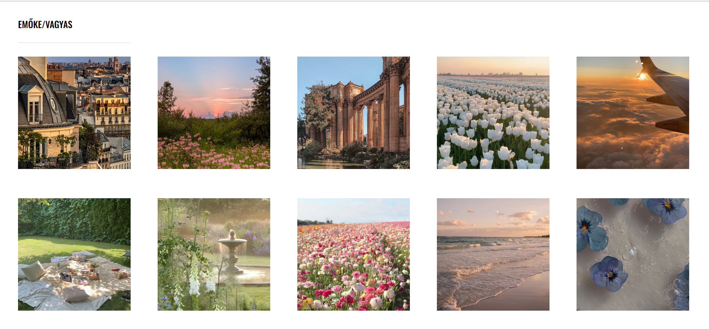

# Photo Blog

## Project Overview

The **Photo Blog** is a simple, clean, and responsive web page that displays a collection of images in a grid format. The site is built with HTML5 and CSS3, using custom styles to showcase images with a uniform design and modern font for the navigation. This project demonstrates the use of CSS Grid properties and custom fonts.

## Features

- **Responsive Layout**: Images are displayed in a grid that adjusts based on the screen size.
- **Custom Typography**: The project uses the **Oswald** font from Google Fonts for a clean, modern look.
- **Consistent Image Styling**: All images are uniformly styled with `object-fit` to ensure they maintain their aspect ratio and fit perfectly within the specified dimensions.
- **Simple Navigation**: A minimal navigation bar with the site creator's name styled with uppercase, custom fonts.

## Technologies Used

- **HTML5**: Basic structure and content of the web page.
- **CSS3**: Used for styling the images and navigation bar, ensuring responsive design and consistency in appearance.
- **Google Fonts**: Oswald font is used for text styling in the navigation bar.

## File Structure

```bash
photo-blog/
│
├── photosite.html   # Main HTML file that contains the image grid layout
├── photos.css       # Custom CSS file for styling the images and the navigation bar
└── pictures/        # Folder containing all the images displayed on the page
```

## Setup Instructions

### 1. Clone the Repository

To get a local copy of the repository, clone it using Git:

```bash
git clone https://github.com/EmokeVagyas/photo-blog
```

### 2. Navigate to the Project Directory

```bash
cd photo-blog
```

### 3. Open the Project

Simply open `photosite.html` in a browser to view the website:

```bash
open photosite.html
```

Alternatively, you can use a local development server, such as **Live Server** in VSCode.

## Custom CSS Explanation

### Image Styling

The images are uniformly styled with the following properties:
- **`width`**: Sets the width of the images to 200px.
- **`max-height`**: Ensures the height does not exceed 200px.
- **`object-fit`**: Maintains the aspect ratio of the image while fitting within the container.
- **`place-items`**: Centers the images within the grid.

```css
img {
    width: 200px;
    max-height: 200px;
    object-fit: cover;
    place-items: center;
    margin: 24px;
}
```

### Navigation Bar

The navigation bar is styled with the **Oswald** font, text transformed to uppercase, and a border at the bottom to create a clean and professional look.

```css
nav {
    font-family: "Oswald", sans-serif;
    font-optical-sizing: auto;
    font-weight: 500;
    font-style: normal;
    text-transform: uppercase;
    border-bottom: 2px solid #f1f1f1;
    width: 200px;
    margin-left: 24px;
    padding: 20px 0;
}
```

## Screenshots

### Photo Blog


## License

This project is licensed under the MIT License - see the [LICENSE](LICENSE) file for details.

## Contact

Created by **Emőke Vagyas** - [GitHub](https://github.com/EmokeVagyas) - feel free to reach out for any questions or collaborations!
